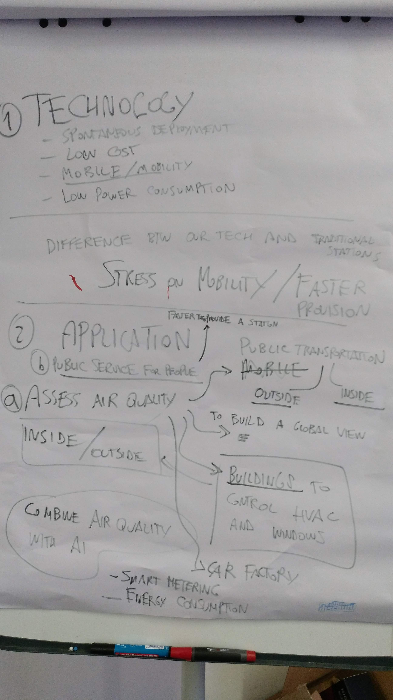
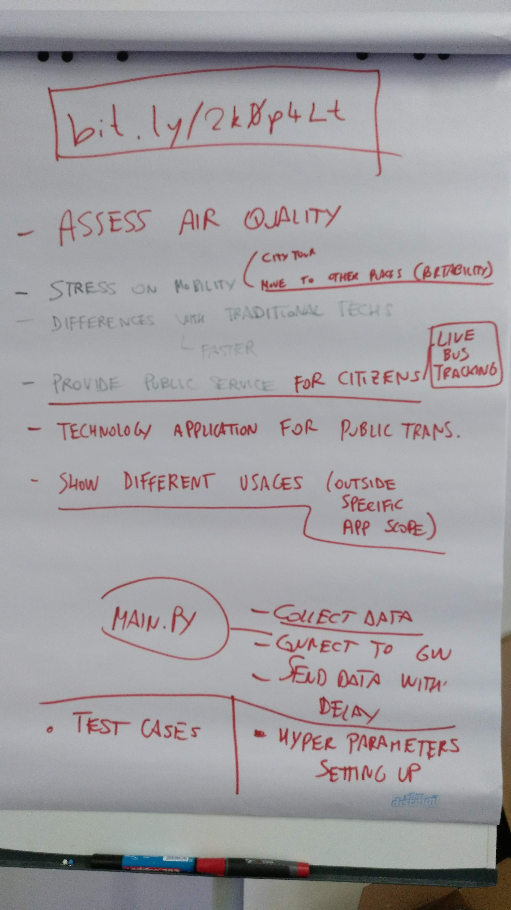

# IoTmeetsAI-Challenge4

## Goal: Assess Air Quality

### Timeline

Task | Timing
---|---
Coding | Wed. before 12
Testing / Code refinement | Wed. 14 - 16
Testing | Wed. Lunch - end of day
Presentation | Wed. Lunch - Thurs. Lunch

### Working Groups

#### Test Cases *[Eric, Benjamin, ...]*

2. Drone Flight
3. Public Transportation
4. Home Electronic Devices (Refrigerators)
5. (...)

#### Code completion *[Stefano, Oliver]*

7. Transmission intervals need to be defined
8. Measuring intervals need to be defined
  * Temperature
  * Humidity
  * GPS
  * Air Quality

#### Presentation *[Nasrin, Mohammad, ...]*

8. Storyline
9. Slide deck
10. Data Interface

### First discussion (Monday)

